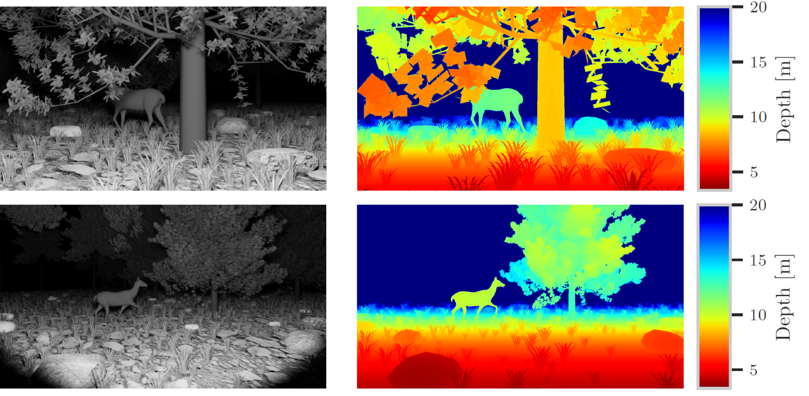

# Synthetic Animal Rendering

This codebase may be used to render images of 3D animal models with corresponding instance segmentation annotations using [Blender](https://www.blender.org/). It has been used to generate the synthetic dataset used in `Exploiting Depth Information for Wildlife Monitoring` [[`arXiv`](https://arxiv.org/abs/2102.05607)] [[`PDF`](https://arxiv.org/pdf/2102.05607)]. We use a modified version of [bpycv](https://github.com/DIYer22/bpycv) in `modules/bpycv` to render instance and class annotations.



## Setup

You will need some animal and environmental assets not included in this repository. We used the following assets:

- [Animal pack deluxe](https://assetstore.unity.com/packages/3d/characters/animals/animal-pack-deluxe-99702)
- [Ground Dirt 008](https://www.poliigon.com/texture/ground-dirt-008/907)
- [Low-Poly Rock Set](https://free3d.com/3d-model/low-poly-rock-set-5-different-rocks-92678.html)
- [Realistic Trees Scene](https://free3d.com/3d-model/realistic-tree-pack-3-trees-95419.html)
- [Grass](https://www.blog.viz-people.com/blog/free-3d-model-grass/)
- [Grass (Low Poly)](https://free3d.com/3d-model/grass-low-poly-59616.html)
- [High Quality Grass](https://free3d.com/3d-model/high-quality-grass-78178.html)

Download these assets, unpack the archives and put the resulting files into the `assets` directory. You can configure new assets and specify the correct asset paths in the `render.py` file.

To simplify dependency management, we recommend rendering using a Docker container. Install Docker and then run:
```
docker build -t synthetic-animals .
```

## Rendering

To start rendering images, run:
```
docker run -it -v $PWD/out:/out -e SCENE_VARIANT=day synthetic-animals blender scene_day.blend --background --python render.py
```
for daytime scenes, or:
```
docker run -it -v $PWD/out:/out -e SCENE_VARIANT=night synthetic-animals blender scene_night.blend --background --python render.py
```
for nighttime scenes. The results will be written into the `out` directory.

## Cite

Please consider citing:
```
@article{haucke2021exploiting,
  title={Exploiting depth information for wildlife monitoring},
  author={Haucke, Timm and Steinhage, Volker},
  journal={arXiv preprint arXiv:2102.05607},
  year={2021}
}
```

## License

All code is licensed under the MIT license (see LICENSE).